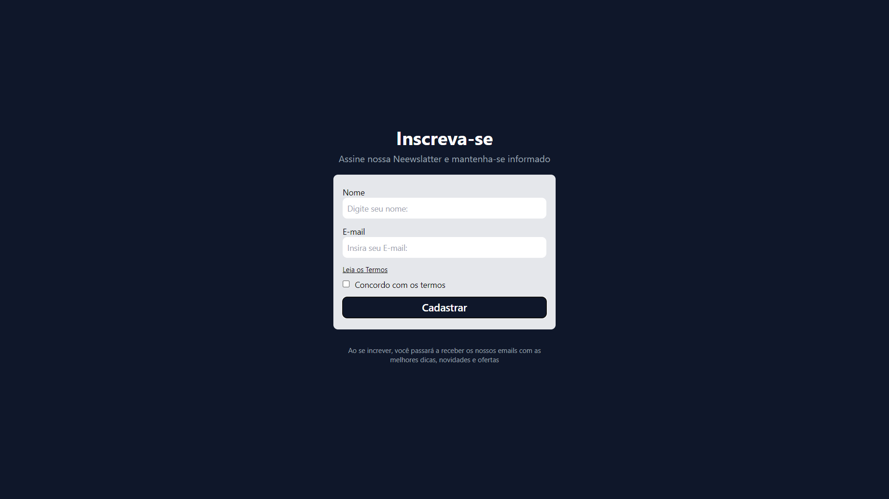

  

## 🚀 Tecnologias

Esse projeto foi desenvolvido com as seguintes tecnologias:

- TypeScript
- React.js
- Tailwind
- Git e Github

## 💻 Projeto

Projeto de estudo desenvolvido com acompanhamento do Matheus Battisti, do canal Hora de Codar, compreendendo detalhadamente cada tecnologia utilizada.

Trata-se de um formulário simples para assinatura de uma newsletter, com validação para cada dado fornecido nos campos de input.